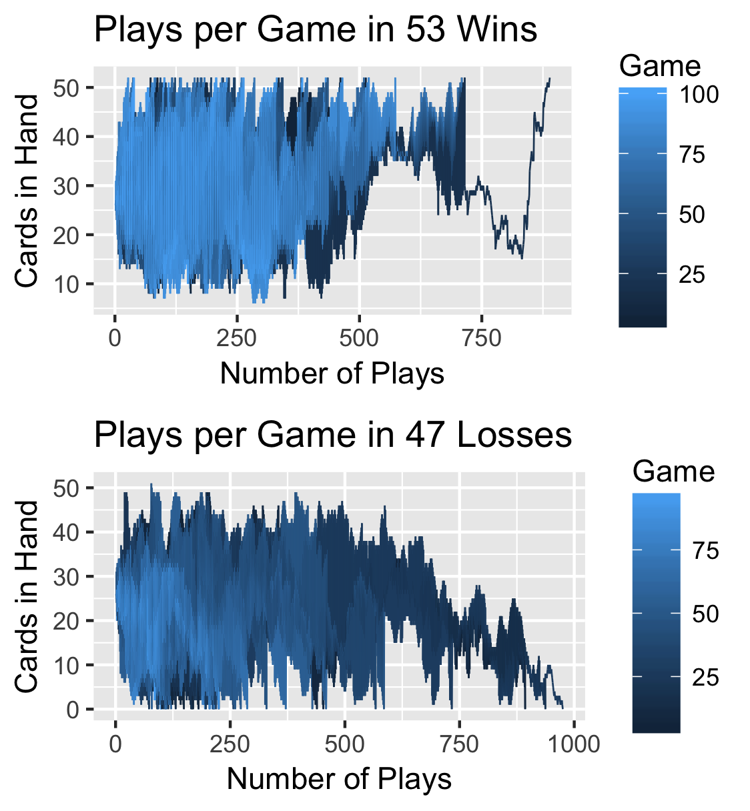
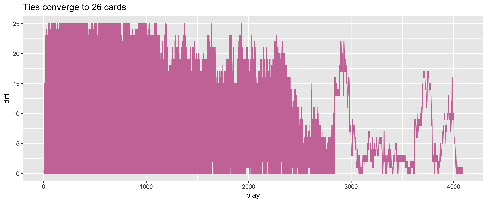

# war-card-game

R script to simulate a War card game, adapted from http://www.premiersoccerstats.com/wordpress/?p=825. 

To come are scripts to explore probabilities of winning.

## Two topics:
1. In a game that goes on forever, the number of cards in a hand converges to a limit of 26 (half the deck).
2. Model the probability of a hand winning as a Markov process

## Limit of a sequence to resolve ties

## Markov process

We construct a 53 x 53 matrix. Each cell in row i, column j has a probability of a hand going from i number of cards to j number of cards. By exponentiating the matrix, we can calculate the probability of the hand winning.
